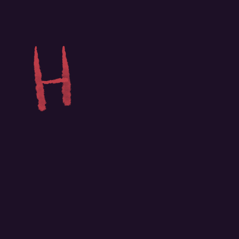

	

# 👋 Olá, eu sou Guilherme Messias!

 Desenvolvedor Full-Stack em construção, movido pela curiosidade e por aquela vontade de transformar café em código.

💡 Curto criar soluções que simplificam a vida, automatizam tarefas chatas e resolvem problemas de forma inteligente.

📚 Desde 2023 venho mergulhando de cabeça no mundo da programação, explorando de arquitetura de software a boas práticas de qualidade.

## 🚀 Tecnologias & Ferramentas

	
<strong>Front-end</strong>

  

	
	
	
	
	
	
	
	
	
	
	
	
	

	
<strong>Back-end</strong>

  

	
	
	
	
	
	
	

	
<strong>Banco de Dados & DevOps</strong>

  

	

	
<strong>Ferramentas & Outros</strong>

  

	
	
	
	
	
	
	
	

---

## 🏆 Projetos em Destaque

- [Projeto 1](#) — Breve descrição do projeto 1.
- [Projeto 2](#) — Breve descrição do projeto 2.
- [Projeto 3](#) — Breve descrição do projeto 3.

---

	
<strong>🎌 Estatísticas do GitHub</strong>

  
	
	 
	
	 
	

---

	<h3>Entre em contato</h3>
	
	
	

	 
	

