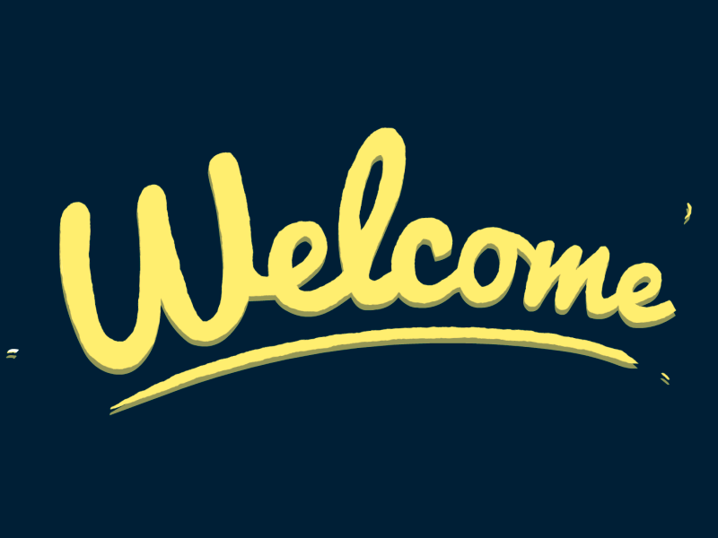

# Guilherme Messias

### Do problema ao deploy.

Desenvolvedor Full Stack construindo produtos digitais completos,  
da interface e regras de negócio ao banco de dados, testes e publicação.

 

---

## Sobre mim

Gosto de transformar problemas e ideias em aplicações que possam ser realmente utilizadas.

Desenvolvo produtos web completos, participando de diferentes etapas do processo: definição da solução, construção da interface, implementação de APIs, modelagem do banco de dados, autenticação, testes e deploy.

Minha principal base é o ecossistema **TypeScript**, com experiência em **Angular, React, Next.js e Node.js**, além de PostgreSQL, Prisma e Docker.

Mais do que escolher uma tecnologia, procuro entender o problema, definir regras claras e construir uma solução organizada, sustentável e simples de evoluir.

---

## Atualmente

- Desenvolvendo aplicações com **React, Angular e Node.js**
- Aprofundando conhecimentos em arquitetura de aplicações full stack
- Construindo projetos autorais voltados a problemas reais
- Evoluindo práticas de testes, organização de código e integração com APIs
- Buscando minha primeira oportunidade como desenvolvedor estagiário ou júnior

---

# Projetos em destaque

## 🧠 DevSnap

  

### Transforme erros e soluções em conhecimento reutilizável.

Aplicação de revisão espaçada voltada para desenvolvedores. Permite registrar bugs, tentativas, soluções e aprendizados em episódios organizados por tecnologia.

O projeto possui modo de revisão focada, captura rápida de anotações, histórico de aprendizado e exportação dos registros em Markdown.

**Destaques técnicos**

- Arquitetura baseada em componentes standalone
- Estado reativo com Signals
- Formulários reativos
- Serviços desacoplados
- Lazy loading
- Persistência local
- Estrutura preparada para integração com API REST

**Tecnologias**

`Angular` `TypeScript` `RxJS` `Signals` `Angular Material` `Tailwind CSS`

  

  

---

## 🎵 Lacrei.io

  

### Transforme uma música em uma carta para o seu futuro.

Aplicação full stack que permite escolher uma música, escrever uma mensagem e definir uma data futura. No dia escolhido, o conteúdo é enviado por e-mail como uma cápsula do tempo musical.

A aplicação integra serviços externos para pesquisa e reprodução de músicas, autenticação de usuários, persistência de dados e agendamento automático dos envios.

**Destaques técnicos**

- Autenticação OAuth
- Modelagem relacional
- Integração com APIs externas
- E-mails transacionais
- Tarefas agendadas
- Validação e persistência de dados
- Arquitetura organizada por funcionalidades

**Tecnologias**

`Next.js` `TypeScript` `PostgreSQL` `Prisma` `NextAuth` `Resend` `Vercel Cron Jobs`

  

  

---

## 🛒 PauseUp

  

### Dê tempo para a decisão antes de realizar a compra.

Aplicação full stack voltada ao consumo consciente. O usuário registra uma intenção de compra, define um período de reflexão e revisita a decisão com mais contexto antes de comprar ou desistir.

O sistema possui autenticação, regras de negócio baseadas no estado da decisão, reagendamento de revisões e persistência individual dos dados.

**Destaques técnicos**

- CRUD completo
- Autenticação de usuários
- APIs REST
- Regras de negócio por status
- Modelagem relacional
- Validação de dados
- Testes automatizados
- Deploy em produção

**Tecnologias**

`Next.js` `TypeScript` `PostgreSQL` `Prisma` `NextAuth` `Tailwind CSS` `Vitest`

  

  

---

# Outros projetos

### 📚 Skillshelf

Aplicação para organização de cursos, materiais e anotações, desenvolvida em PHP seguindo arquitetura MVC.

`PHP` `SQLite` `HTML` `Tailwind CSS`

[Ver repositório](LINK_DO_REPOSITORIO_SKILLSHELF)

### ✍️ FormataX

Ferramenta web para padronização e transformação de textos, com recursos de remoção de acentos, pontuação e capitalização.

`HTML` `CSS` `JavaScript` `GitHub Pages`

[Ver aplicação](LINK_DO_FORMATAX) · [Ver repositório](LINK_DO_REPOSITORIO_FORMATAX)

---

# Tecnologias

## Desenvolvimento de interfaces

  

## Backend e APIs

  

## Dados e infraestrutura

  

## Testes e ferramentas

  

---
## Atividade no GitHub

  

  

> As linguagens exibidas representam os repositórios públicos e não definem, isoladamente, meu nível de experiência ou área de atuação.

---

## Vamos construir algo?

Estou aberto a oportunidades como **Desenvolvedor Full Stack, Front-end ou Back-end**, em nível de estágio ou júnior.

 
 

**Do problema ao deploy.**

